# QA Workflow Documentation

## Overview

The **Check QA Process** workflow is an automated GitHub Actions workflow designed to manage the Quality Assurance (QA) process for pull requests. It handles label-based QA requirements, automatic reviewer assignment, mobile deployment triggering, and approval verification.

## File Location
`.github/workflows/qa.yml`

## Triggers

The workflow is triggered by the following events:

### Pull Request Events
- `opened` - When a new PR is created
- `reopened` - When a PR is reopened
- `labeled` - When a label is added to a PR
- `unlabeled` - When a label is removed from a PR  
- `synchronize` - When new commits are pushed to a PR

### Pull Request Review Events
- `submitted` - When a review is submitted
- `dismissed` - When a review is dismissed

## Concurrency

The workflow uses concurrency control to prevent multiple instances from running simultaneously:
- **Group**: `qa-proccess-${{ github.event.pull_request.number }}`
- **Cancel in Progress**: `true` (cancels previous runs when a new one starts)

## Permissions

The workflow requires the following permissions:
- `pull-requests: write` - To add reviewers and comments
- `issues: write` - To add comments to PRs (treated as issues for API purposes)
- `contents: read` - To read repository contents
- `checks: write` - To create status checks

## Environment Variables

| Variable | Description | Value |
|----------|-------------|-------|
| `QA` | Checks if PR has 'qa' label | `${{ contains(github.event.pull_request.labels.*.name, 'qa') }}` |
| `NOQA` | Checks if PR has 'noqa' label | `${{ contains(github.event.pull_request.labels.*.name, 'noqa') }}` |

## Jobs

### 1. detect_label 🏷️

**Purpose**: Detects QA-related labels and performs initial setup actions.

#### Steps:

##### Add Reviewer to PR
- **Condition**: PR has 'qa' label AND event is 'pull_request'
- **Action**: Automatically adds `JuJoDevs` as a reviewer
- **API Used**: GitHub REST API to request reviewers

##### Comment on PR to Trigger Mobile Deploy
- **Condition**: PR has 'qa' label AND event is 'pull_request'
- **Action**: 
  - Waits 5 seconds to avoid race conditions
  - Posts `/deploy-mobile` comment to trigger mobile deployment
- **API Used**: GitHub REST API to create issue comments

##### Skip QA and Continue
- **Condition**: PR has 'noqa' label AND event is 'pull_request'
- **Action**: Logs that QA is disabled and continues without QA verification

##### Continue to QA Approval
- **Condition**: Event is 'pull_request_review'
- **Action**: Logs transition to QA approval step

### 2. qa-approval ✅

**Purpose**: Verifies QA approval status and enforces approval requirements.

**Dependencies**: Requires `detect_label` job to complete first.

#### Steps:

##### Check QA Approval Status
- **Condition**: PR has 'qa' label
- **Action**: 
  - Fetches all reviews for the PR using GitHub API
  - Checks if `JuJoDevs` has provided the latest approval
  - Sets output variable `approval` to `true` or `false`
- **Output**: `steps.qa-review.outputs.approval`

##### Send Approval Success Check
- **Condition**: QA approval check failed (`approval=false`)
- **Action**: 
  - Logs error message
  - Exits with status code 1 (fails the workflow)

##### QA Not Required
- **Condition**: PR has 'noqa' label
- **Action**: Logs that QA is not required and skips verification

##### Continue to QA Approval (Default Case)
- **Condition**: PR has neither 'qa' nor 'noqa' labels
- **Action**: 
  - Logs that no QA labels were detected
  - Exits with status code 1 (fails the workflow)

## Workflow Logic Flow

```mermaid
flowchart TD
    A[PR Event Triggered] --> B{Check Labels}
    B -->|qa label| C[Add JuJoDevs as Reviewer]
    B -->|qa label| D[Comment /deploy-mobile]
    B -->|noqa label| E[Skip QA Process]
    B -->|no qa labels| F[Fail Workflow]
    
    C --> G[QA Approval Check]
    D --> G
    E --> H[Continue without QA]
    
    G --> I{JuJoDevs Approved?}
    I -->|Yes| J[✅ QA Approved - Continue]
    I -->|No| K[❌ Fail - QA Required]
    
    F --> L[❌ Workflow Failed]
    K --> L
```

## Usage Instructions

### For Developers

1. **To Enable QA**: Add the `qa` label to your pull request
2. **To Skip QA**: Add the `noqa` label to your pull request
3. **Default Behavior**: PRs without QA labels will fail the workflow

### For QA Team

1. **Reviewer Assignment**: When a PR gets the `qa` label, `JuJoDevs` is automatically assigned as a reviewer
2. **Mobile Deployment**: The `/deploy-mobile` comment is automatically posted to trigger deployment
3. **Approval Process**: `JuJoDevs` must approve the PR for the workflow to pass

## Labels Reference

| Label | Effect | Description |
|-------|--------|-------------|
| `qa` | Enable QA Process | Triggers full QA workflow with reviewer assignment and approval requirement |
| `noqa` | Skip QA Process | Bypasses QA requirements and allows PR to continue without QA approval |
| *none* | Workflow Fails | PRs without QA-related labels will fail the workflow |

## API Endpoints Used

1. **Add Reviewers**: `POST /repos/{owner}/{repo}/pulls/{pull_number}/requested_reviewers`
2. **Add Comments**: `POST /repos/{owner}/{repo}/issues/{issue_number}/comments`
3. **Get Reviews**: `GET /repos/{owner}/{repo}/pulls/{pull_number}/reviews`

## Error Handling

- **Missing QA Approval**: Workflow fails with error message if QA approval is required but not found
- **No Labels**: Workflow fails if neither `qa` nor `noqa` labels are present
- **Race Conditions**: 5-second delay before commenting to prevent conflicts

## Troubleshooting

### Common Issues

1. **Workflow failing with "QA approval required"**
   - Ensure `JuJoDevs` has approved the PR
   - Check that the approval is the most recent review

2. **Reviewer not added automatically**
   - Verify the PR has the `qa` label
   - Check GitHub token permissions

3. **Mobile deployment not triggered**
   - Confirm `/deploy-mobile` comment was posted
   - Check if mobile deployment workflow exists and is properly configured

### Debugging Steps

1. Check workflow logs in GitHub Actions tab
2. Verify label presence on PR
3. Confirm API responses in workflow logs
4. Review GitHub token permissions

## Security Considerations

- Uses `GITHUB_TOKEN` with minimal required permissions
- API calls are authenticated and scoped to the repository
- No sensitive data is exposed in logs

## Maintenance

- **Reviewer Updates**: Change `REVIEWER=JuJoDevs` in the workflow file to update the default QA reviewer
- **Label Names**: Update label references if QA label names change
- **API Versions**: Current implementation uses GitHub API version `2022-11-28`